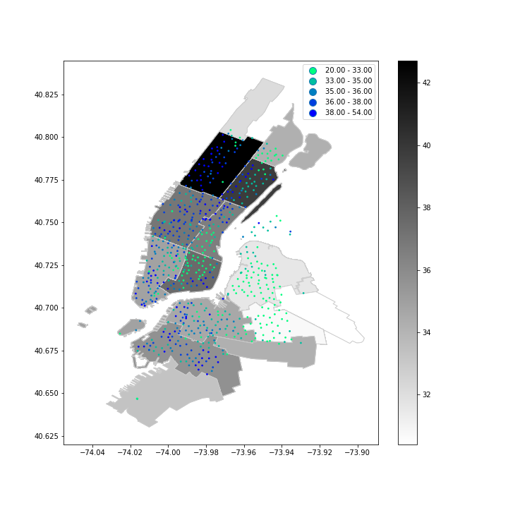
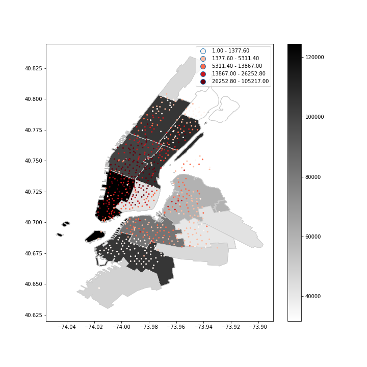

# Assignment 1

* Incorporated changes as per peer review
  * Reversed color scheme for point values.
  * Performed spatial join to only include relevant PUMA's containing citibike stations.
  * set ax.axes.set_aspect('equal) for better clarity of plot.
  
  ### Figure 1: Figure 1: This plot displays the median age of each puma against which the median age of the ridership of each citibike station is plotted. It appears that median age at citibike station is correlated with the overall median age at each puma
  
  ### Figure 2: This plot displays the female to male ratio of each puma against which the female to male ridership of each citibike station is plotted.
  
  ### Figure 3: This plot displays the income of each puma against which the total ridership of each citibike station is plotted. It appears that higher income areas have higher ridership citibike stations.

# Assignment 2

* Worked independently on the assignment

* Part 1: Identified the significant event which caused ridership across all stations.
* Part 2: Identified the change in ridership from the beginning to the end for different card types.
* Part 3: Performed random forest classifier for following feature types:
          1. Slope , intercept, mean and standard deviation of the timeseries
          2. Weekly ridership values
          
          Identified the important features of the classification process.