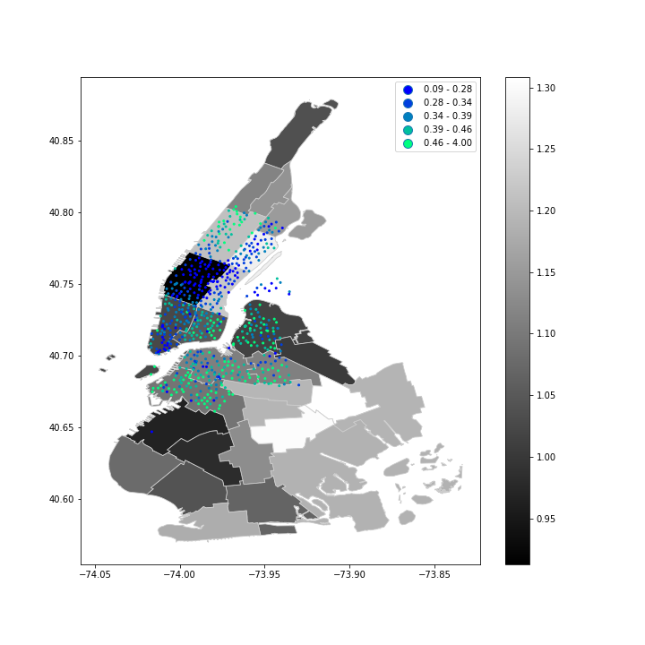
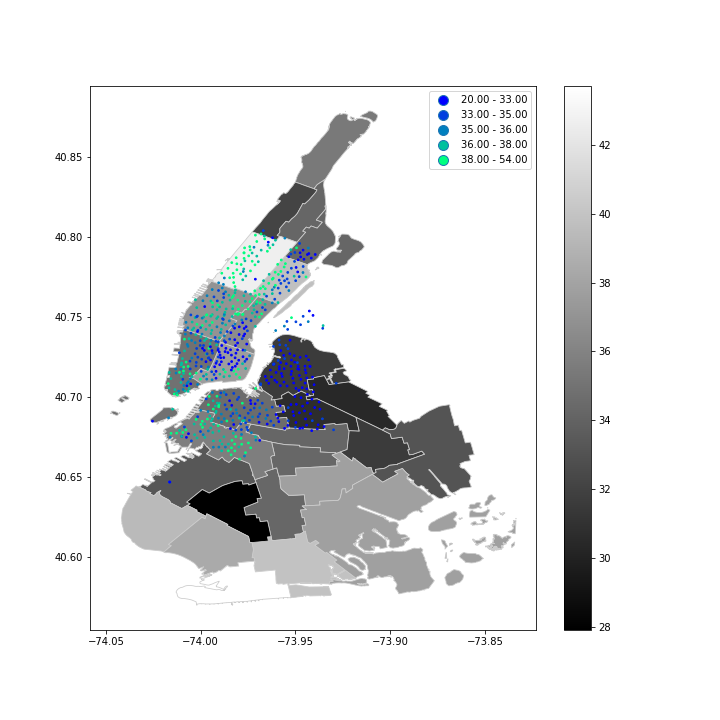

## Review:
The improvements suggested below apply to all the plots.  
Where needed specific remarks are sugegsted.

**Clarity**: The intention of the plots is to compare characteristics of citi bike stations with the socio-economic characteristics of their respective PUMAs. Therefore, it is useless to plot PUMAS that do not have any citi bike stations in it. Dropping empty PUMAS would result in focused and more clear plots.
Figure 2 which intends to compare gender ratios happen to mention a relation of the ratio to income in the caption. Income is not demonstrated in that plot and I believe it is irrelevant to mention it as the reader cannot see the relation.
The relationship concluded in the caption of figure 3 is not accurate. Some wealthy PUMAS such as that in Brooklyn show low ridership.
Aggregating the citi bike data (e.g. mean or median of ages/gender ration/total ridership) would help the reader better quantify the relation with the respective PUMA.

**Esthetic**: The color scheme is not proper especially when darker colors from both variables overlap. Choosing contrasting color schemes would improve the readability of the plot. Another way to improve the plot aesthetically is to set the aspect ratio (e.g. ax.axes.set_aspect('equal)) making it easier to determine in which puma does each citi bike data point fall. A larger figure size is also needed to make the plots clearer.

**Honesty**: I do not see any intention to manipulate the data.

### Figure 1: This plot displays the median age of each puma against which the median age of the ridership of  each citibike station is plotted. It appears that younger median age at citibike station is correlated with the younger median age at each puma

### Figure 2: This plot displays the female to male ratio each puma against which the female to male ridership of each citibike station is plotted. It appears that female to male ratio is higher in mid income areas

### Figure 3: This plot displays the  income of each puma against which the total ridership of each citibike station is plotted. It appears that higher income areas have higher ridership
