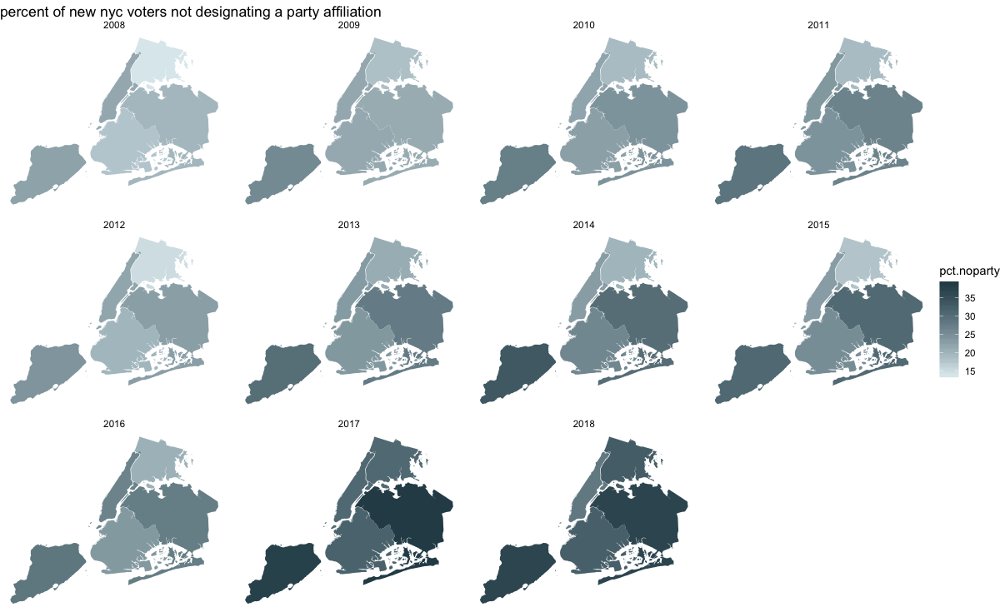

# PLOT REVIEW

## CLARITY

* The plot effectivey captures the trend of the increasing percentage of voters who register without decaring an party affiliation.

## ESTHETICS

* From an esthetics poit of view, blue is a very effective color when it comes to capturing the users' attention, something which Ursula has effectively employed.

* There is no cluttering of extraneous geometrical elements as such which distracts the user from the infographic.

## HONESTY

* I feel if a similar infographic displaying the trend of the newly registered voters who actually declare their party affiliation would have augmented the exiting visualization, as the user would gain the complete picture of how party loyalties are changing in New York with the course of time.
